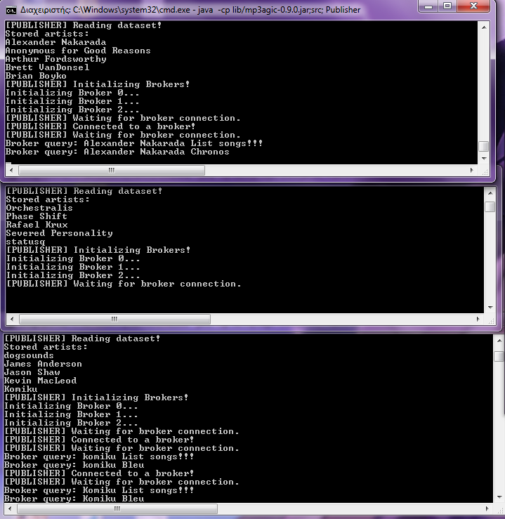
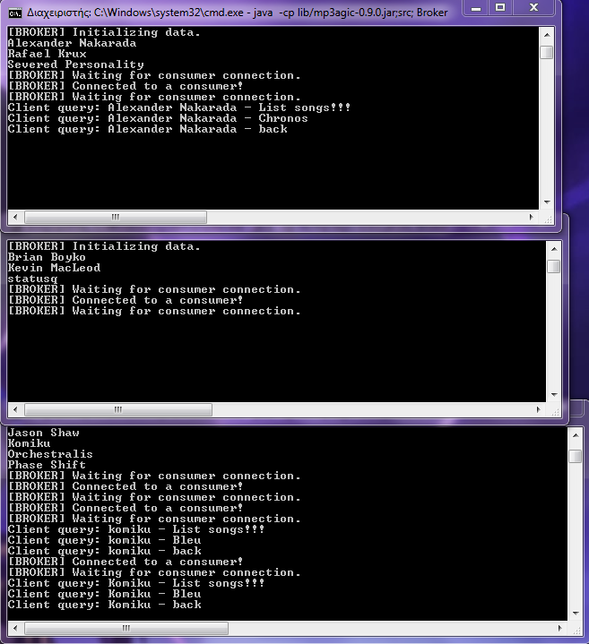
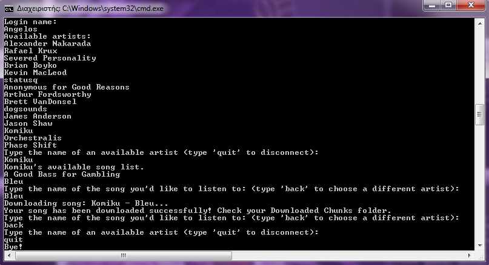
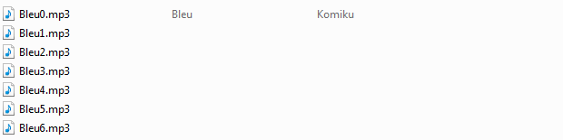
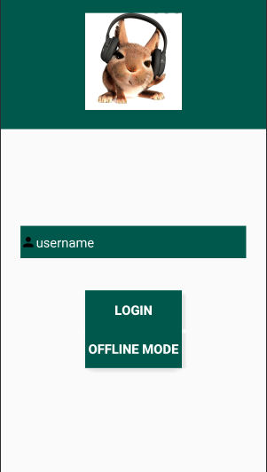

# **About this project**

>The purpose of this Java Project is to build a music streaming app. In [phase one](Project), the back end of the service is made and executed from the command line, where a consumer (client) is connected to multiple servers in order to download a song they like. In [phase two](Aggelis), the client side app is implemented using android studio.

# **Contents**
- [**About this project**](#about-this-project)
- [**Contents**](#contents)
- [**How to run**](#how-to-run)
- [**Implementation**](#implementation)
- [**Example**](#example)
- [**Android Client App (Phase Two)**](#android-client-app-phase-two)
  - [How to run](#how-to-run-1)
  - [Android app use-cases](#android-app-use-cases)

# **How to run**
1) Download all the files in the [Project](Project) directory.
2) Go to [`Node.java`](Project/src/Node.java) and change the ip in line 12, to match yours.
    * *Run* `ipconfig /all` *in cmd, copy your IPv4 address and replace* `0.0.0.0` *in line 12.*
3) From cmd, go to the Project directory: `cd <YOUR PATH>\Project`
4) Compile everything using the following: `javac -cp lib/mp3agic-0.9.0.jar; src/*.java` 
5) Open 6 Command lines (3 for the Publishers and 3 for the Brokers) and in each do the following:
    * Go to Project directory *(step 3)*.
    * Run the following command in the first 3 cmds ([**Publishers**](Project/src/Publisher.java)):  `java -cp lib/mp3agic-0.9.0.jar;src; Publisher`
    * Run the following command in the latter 3 cmds ([**Brokers**](Project/src/Broker.java)):  `java -cp lib/mp3agic-0.9.0.jar;src; Broker`
    * Run the following command to test the client side, open new cmds (up to 100 clients at a time) located in the Project directory ([**Consumers**](Project/src/Consumer.java)):  `java -cp lib/mp3agic-0.9.0.jar;src; Consumer`
6) After successfully running these steps, all the publishers and all the brokers should be waiting for new client connections and queries. 3 new files named `Broker0.txt`, `Broker1.txt` and `Broker2.txt` will have been made, containing info regarding each initialized Broker.

# **Implementation**

In order to implement this project the following have been used:
* An interface - [`Node.java`](Project/src/Node.java)
    > The Node class is an interface that has fixed ips and ports for each Broker and Publisher. We use a singular ip because we assume that the Publisher and Broker servers exist in the same network. Each one of the 3 Brokers/Publishers are mapped to a different port because they run in the same network. The Publisher, Broker, Consumer classes extend this Interface, therefore they have access to the ip and ports.
* The 3 main java files of the project, implementing the interface above: 
    > Publishers and Brokers during initialization, read and refresh files [`initPublisher.txt`](Project/src/initPublisher.txt) and [`initBroker.txt`](Project/src/initBroker.txt) respectively. 
    > * File `initPublisher.txt` has a value that shows how many artists have been *"read"* by previous Publishers and starts with value 0. The data folder is then divided into subfolders (a total of 15) named after each artist and each Publisher reads 5 (a third of these subfolders) artists.
    > * File `initBroker.txt` has a value indicating how many Brokers are currently running and starts with a value of 0. In both cases the last (3rd) Publisher/Broker re-initializes the txt files' value to 0, so if you have initialized all Publishers and Brokers correctly, there is no need to edit them manually.  *For more details check the comments inside the code.*
   * [`Publisher.java`](Project/src/Publisher.java)
       > The servers holding the [**dataset**](Project/data) of this Project. The data is split in three parts and each Publisher is responsible for a approximately a third of the dataset. The Publisher pushes data to the Broker, when the latter asks to receive the artist list, song list or a specific song.
   * [`Broker.java`](Project/src/Broker.java)
       > "Middle man" between the main servers (Publisher) and the clients (Consumer). Each one of them can hold up to 100 threads. The Consumer sends their query to the Broker (eg. a song name), the Broker passes this query to the corresponding Publisher, depending on the artist, the Publisher sends their response (eg. first chunk of the song) and the broker finally pushes it to the Consumer.
   * [`Consumer.java`](Project/src/Consumer.java)
       > The client side. The logs in with a specific username, receives the list of the artists that are available and they can choose which artist they wish to listen to. A song list matching the artist is returned, if they exist, and the client can choose whichever song they want from that list. The files are downloaded in chunks, so that they can be buffered and the user can start listening to them without having to wait for the whole download to finish. The Consumer is implemented as an Android App in [phase two](Aggelis) of this project but for now, the songs will be downloaded as chunks in the [**Downloaded Chunks**](Project/src/Downloaded%20Chunks) directory. 
* 4 extra classes for handling the music files:
   * [`Info.java`](Project/src/Info.java)
        > The Info class stores the ip, port, brokerId and registeredArtists of a Broker, where registeredArtists is a list of artist names for which the Broker is responsible.
   * [`ArtistName.java`](Project/src/ArtistName.java)
        > The ArtistName class stores the name of the artist.
   * [`Value.java`](Project/src/Value.java)
        > An object of the MusicFile class is stored in the Value class, which is then used when we push data from Publisher -> Broker -> Consumer
   * [`MusicFile.java`](Project/src/MusicFile.java)
        > The MusicFile class stores the title (trackName), the artist (artistName), the name of the album (albumInfo), the genre and the chunk musicFileExtract of a song as a byte array.

# **Example**

* The 3 cmds containing the Publishers should look like this:

    
    > During initialization the message `[PUBLISHER] Reading dataset!` will be printed on your screen with a list of artists assigned to said Publisher below. Then a message saying `[PUBLISHER] Initializing Brokers!` indicates that they are waiting for you to initialize the Brokers.
    > Finally, a message indicating that the Publisher is ready to receive queries from the Brokers is printed like so, `[PUBLISHER] Waiting for broker connection.`

* The 3 cmds containing the Brokers should look like this:

    
    > During initialization the message `[BROKER] Initializing data!` will be printed on your screen with a list of artists assigned to said Broker below. Then a message saying `[BROKER] Waiting for consumer connection.` is printed, letting you know that the Broker is ready to receive queries from up to 100 Consumers (threads) at a time. 

* The cmds containing the Consumers should look like this:

    
    > In the beggining you are asked to type your name. Then a list of the available artist is printed with a prompt asking you to choose an artists you might be interested in. Finally, you get to choose to download a song from the list. You can keep browsing artists and downloading songs until you quit the app.

* Finally the [`Downloaded Chunks`](Project/src/Downloaded%20Chunks) directory should look like this after a succesful download. *Song in chunks*

    

# **Android Client App (Phase Two)**

## How to run

* Download and set up the [**Android project**](Aggelis).
* Initialize the Publishers and the Brokers as in [phase one](#how-to-run).
* Run the Consumers from Android studio or your phone, after setting up the project.
  
## Android app use-cases

> In phase one, the client could only download the chunks in the Downloaded Chunks folder. In this app, the client can do the following:

* **Home Page** 
    * You can either log in and browse online, or go to offline mode where you can listen to fully downloaded songs.   